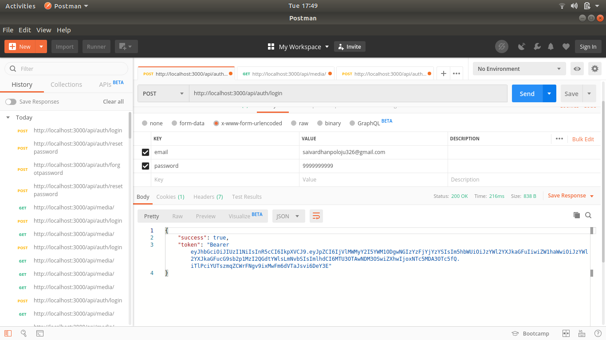
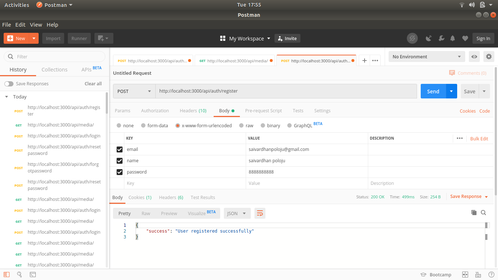
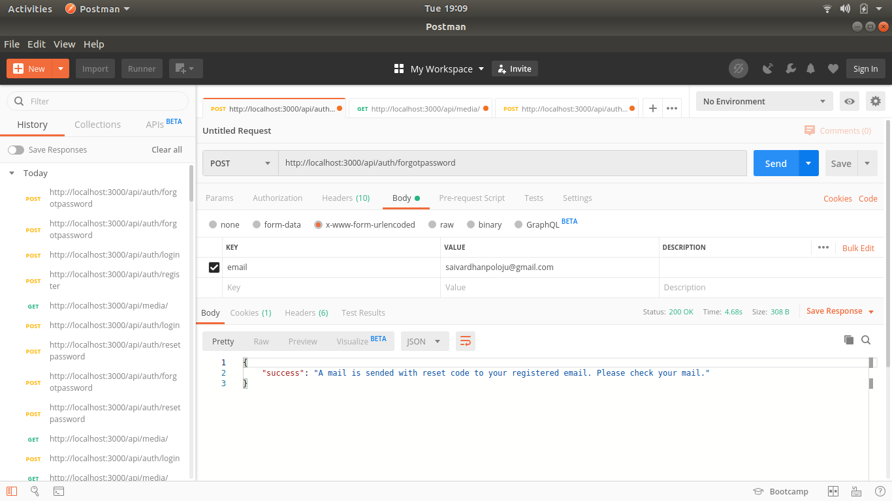
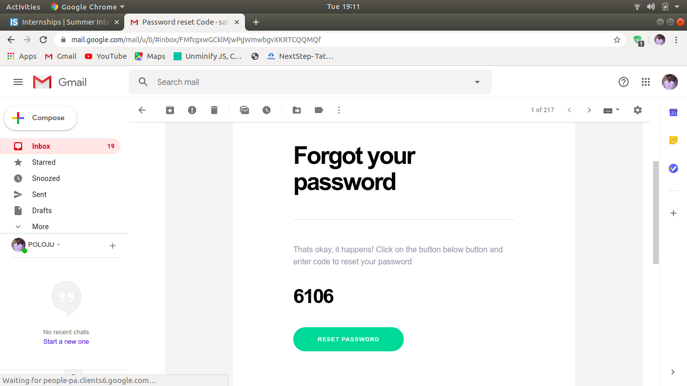
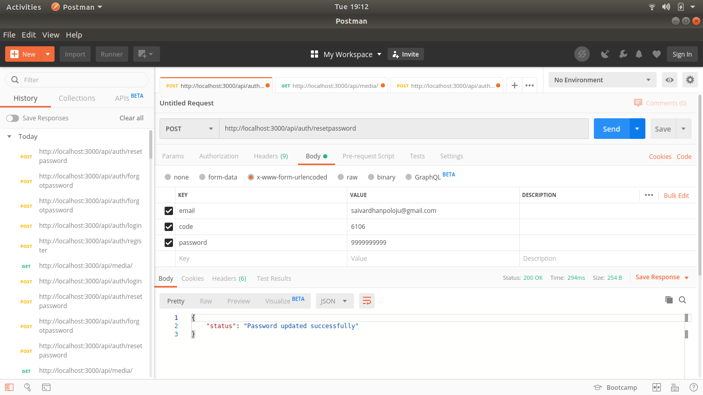
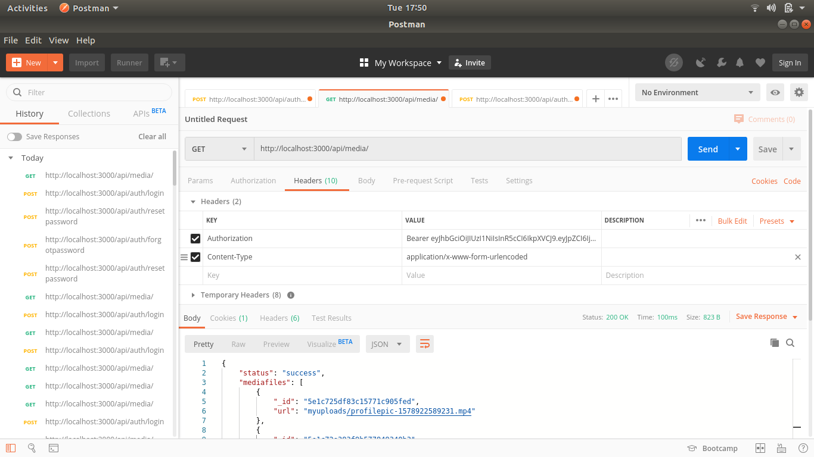

# NodeJS API Application

A simple nodejs application to handle set of API calls. 

## Requirements

* [node & npm](https://nodejs.org/en/)
* [git](https://www.robinwieruch.de/git-essential-commands/)
* [sendgrid](https://sendgrid.com/)

## Required Packages

* [Express](https://expressjs.com/)
* [body-parser](https://www.npmjs.com/package/body-parser)
* [mongoose](https://mongoosejs.com/)
* [passport](http://www.passportjs.org/)
* [express-session](https://www.npmjs.com/package/express-session)
* [cookie-parser](https://www.npmjs.com/package/cookie-parser)
* [bcryptjs](https://www.npmjs.com/package/bcryptjs)
* [jsonwebtoken](https://www.npmjs.com/package/jsonwebtoken)
* [@sendgrid/mail](https://www.npmjs.com/package/@sendgrid/mail)
* [multer](https://www.npmjs.com/package/multer)

### POST and GET Routes

* visit http://localhost:3000
  * /api/auth/register
    * Route - Type : POST
    * Route - Body : email, name & password
    
    
  * /api/auth/login
    * Route - Type : POST
    * Route - Body : email & password

    
  * /api/auth/forgotpassword
    * Route - Type : POST
    * Route - Body : email
    
    

    * After using forgot password route it will send mail with reset code to the registered mail using sendgrid API sservice.

    
  * /api/auth/resetpassword
    * Route - Type : POST
    * Route - Body : email, code, password
    
    
  * /api/media/upload
    * Route - Type : POST
    * Route - Body : medianame, description. media(file)

  * /api/media
    * Route - Type : GET
    * Authorization : Required
    
    